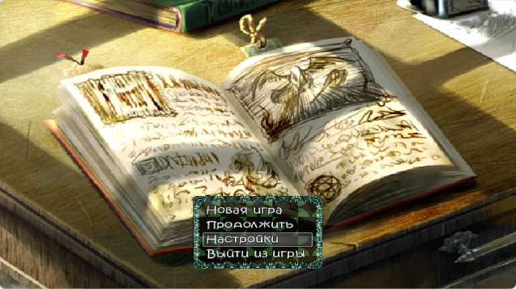
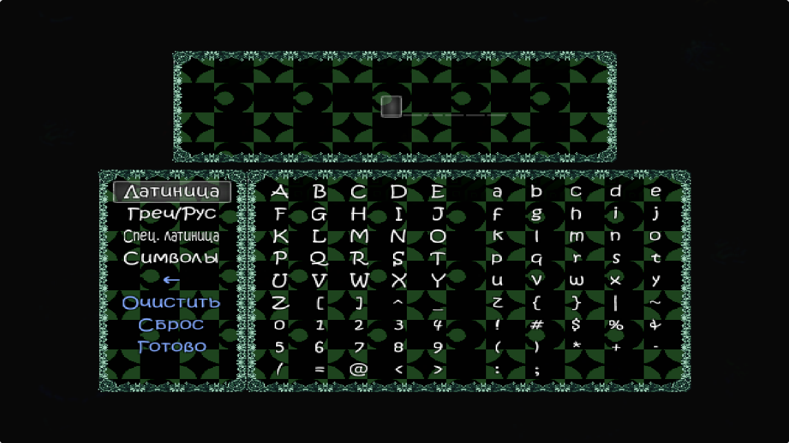

# 🌬️ Journey of Wind and Memory — Русификатор & QoL-мод

**Полный перевод на русский · Uncensored · десятки улучшений качества жизни**

---

Масштабная руссификация и модификация, полностью перерабатывающая игровой опыт, добавляющая множество удобных функций для игроков.

> [!WARNING]
> Игра для взрослых (18+).

## ✨ Что внутри

- 📖 **Полный перевод** — качественный и аутентичный перевод на русский язык.
- 🔞 **Uncensored** — сняты цензурные ограничения оригинала.
- 🎮 **QoL-улучшения** — множество исправлений интерфейса, навигации и игрового процесса, делающих прохождение гораздо более комфортным и плавным.
- 🛠️ **Технические фиксы** — точечные изменения игровых механик, исправления баланса и скрытых багов для улучшения общей динамики игры.
- 🥚 **Пасхалки** — добавлены различные пасхалки в игре.

## 📸 Скриншоты

  
   
  Переработанный экран ввода имени (латиница / кириллица).

## 🚀 Установка

1. Скачайте архив с последней версией из раздела **[Releases](../../releases)**
   (или соберите из исходников репозитория).
2. Распакуйте содержимое в корневую папку установленной игры, заменяя файлы.

> [!IMPORTANT]
> Перед установкой сделайте резервную копию папки `Data` и сохранений.

## 📜 Патчноуты

- **[CHANGELOG.md](CHANGELOG.md)** — список изменений по версиям (текст).
- **[Releases](../../releases)** — сборки + **иллюстрированный PDF-патчноут** (RU/EN,
  со скриншотами) прикреплён к релизу.

## 🧩 Что в репозитории

| Папка | Содержимое |
|-------|------------|
| [`scripts/`](scripts/) | Ruby-скрипты: QoL/геймплей мода + переведённые движковые скрипты |
| [`translation/`](translation/) | Проекты перевода `rvdata2` в формате Translator++ (`.trans`) |
| [`tools/`](tools/) | Аддоны Translator++ для перевода (`linesChecker`, `jsondb-choice-fix`) |

## 👥 Авторы и благодарности

**Оригинальная игра** — [автор (X / Twitter)](https://x.com/xianjuzihuhu14)
*Этот проект — фанатский перевод. Все права на игру принадлежат её автору; поддержите оригинал.*

---

**Ведущий переводчик** — [Lev Lira](https://t.me/hentai12390Lir)
*Перевод сюжета и событий (карты, общие события, враги, отряды), игровые скрипты, дополнительные скрипты и пасхалки.*

**Перевод и инструменты** — toilettrauma
*Перевод части файлов, вспомогательный скрипт WindowFix.*

**Тестирование и помощь с переводом** — [Pidr2009](https://t.me/Pidr2009), Илья Кива, Kapystachka

## 🐛 Обратная связь

Нашли баг, опечатку или неточность перевода? Создайте
**[Issue](https://github.com/liraleva-ship-it/russian-translation-journey-of-Wind-and-Memory-Mod-Demo-0.49/issues)**.

Связь: 📧 [lev.lira_off@outlook.com](mailto:lev.lira_off@outlook.com) · ✈️ [Telegram-предложка](https://t.me/hentai12390Lir)

---

Некоммерческий фанатский проект · правовая информация — <a href="NOTICE.md">NOTICE</a>
 
Разработка ведётся силами сообщества 💛

